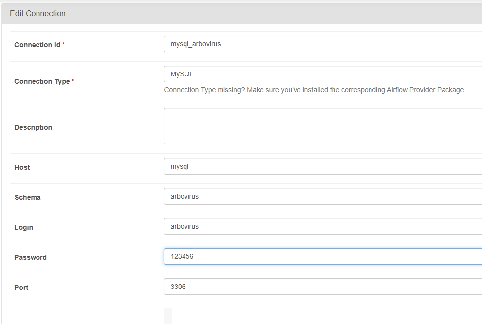

# Ariflow UNEB
Este repositório consiste em um projeto de orquestração de pipelines para a iniciação científica de arbovírus da UNEB. Neste serviço, estamos usando o Apache Airflow, conteinerizado para que possamos usar o executor Celery, e utilizando o PostgreSQL como backend da aplicação e o MySQL como banco de dados.

## Ferramentas utilizadas
- Python
- Airflow
- PostgreSQL
- Docker
- MySQL

## Pipelines em execução
### Extração de sequências (Chikungunya)
Este é um pipeline que faz a extração de sequências da API do GenBank Entrez, salva em XML, extrai as informações mais relevantes inicialmente e carrega no banco de dados.

### Download de artigos
Este pipeline consiste no download de artigos científicos que citam a sequência, com base na coluna de PubMed extraída no primeiro pipeline.

## Como executar
1. Com o terminal aberto na raiz do projeto, execute o compose com o seguinte comando:
``` bash 
docker-compose up -d --build --force-recreate 
```
2. O serviço ficará disponível no Airflow.
3. Caso seja a primeira execução, configure a conexão com o banco de dados conforme a imagem abaixo:

